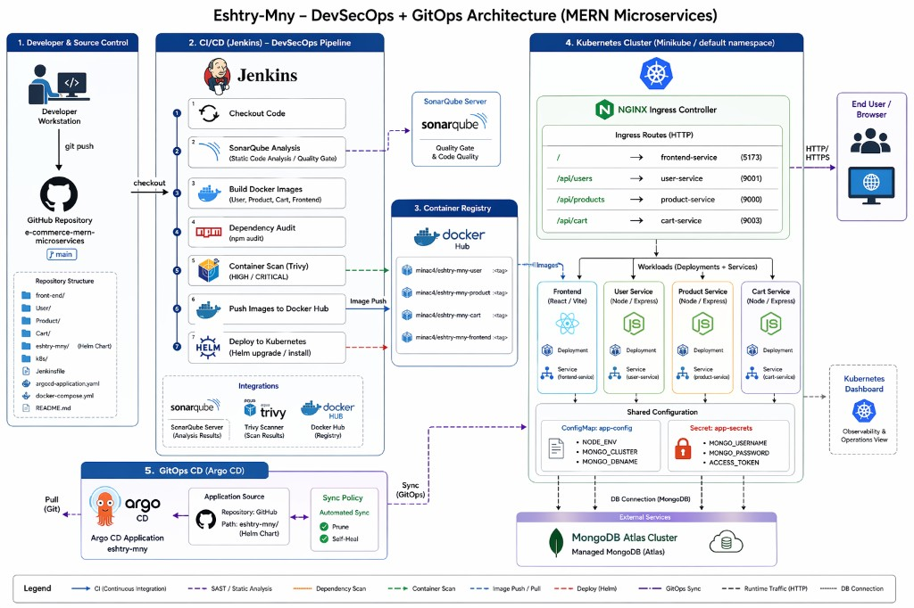
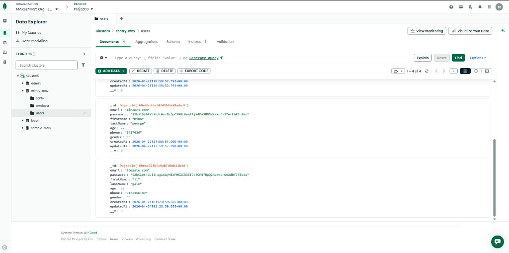
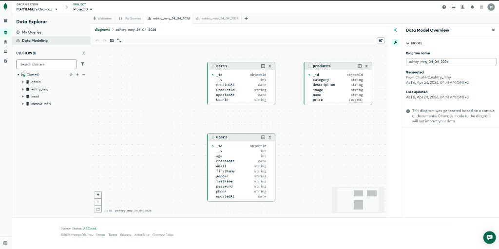
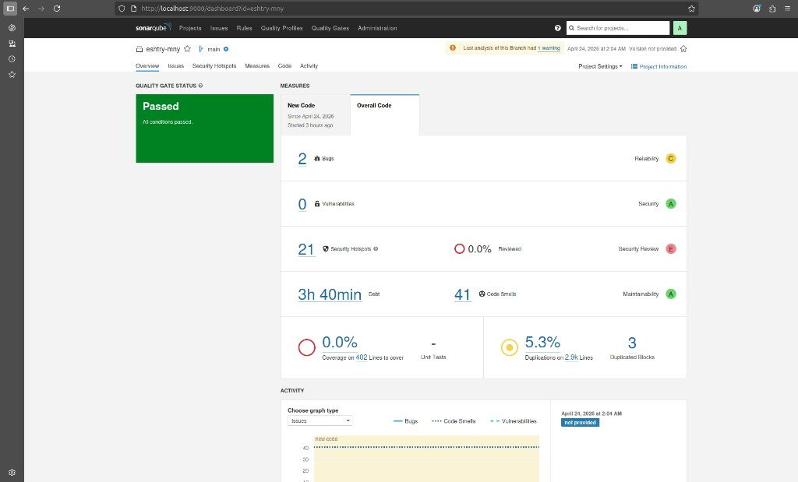
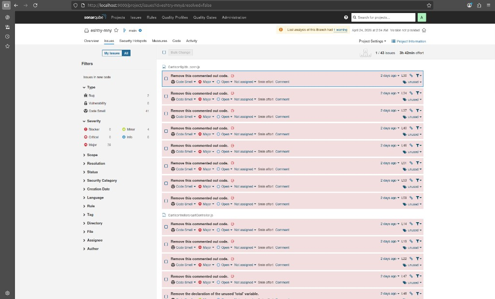
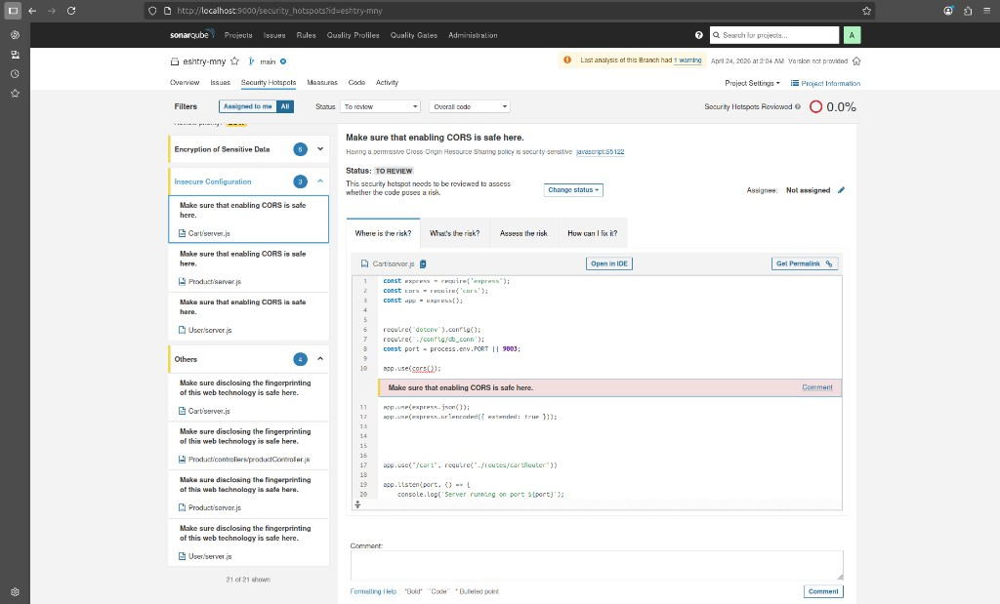
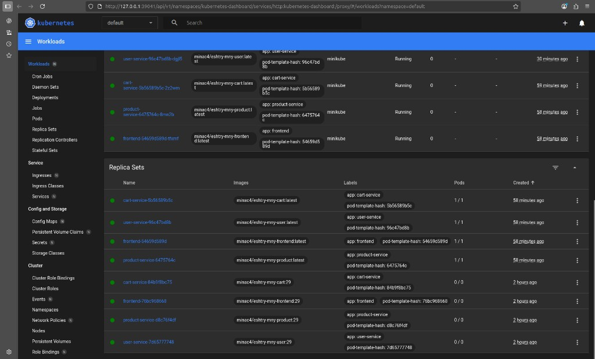

# Eshtry-Mny — MERN Microservices + DevSecOps + GitOps (Jenkins, SonarQube, Trivy, Helm, Argo CD)


## Architecture diagram




An e-commerce demo built as **MERN microservices** (Node.js/Express + MongoDB + React) and deployed to **Kubernetes** using **Helm**, with a **DevSecOps CI/CD pipeline** in **Jenkins** and **GitOps continuous delivery** via **Argo CD**.


## What’s in this repo

### Application services

- **Frontend**: React (Vite) in `front-end/` (dev server on `5173`)
- **User service**: Node.js/Express in `User/` (API on `9001`)
- **Product service**: Node.js/Express in `Product/` (API on `9000`)
- **Cart service**: Node.js/Express in `Cart/` (API on `9003`)
- **Database**: MongoDB (Atlas in this setup)


### DevSecOps & GitOps

- **CI/CD**: `Jenkinsfile`
  - Static code analysis with **SonarQube**
  - Dependency checks with **npm audit**
  - Container image scanning with **Trivy**
  - Build + push images to **Docker Hub**
  - Deploy to Kubernetes using **Helm**
- **Kubernetes**:
  - Raw manifests for reference in `k8s/base/`
  - Helm chart in `eshtry-mny/`
- **Argo CD**: GitOps application definition in `argocd-application.yaml`

## Repository structure 

```text
.
├─ Jenkinsfile
├─ docker-compose.yml
├─ argocd-application.yaml
├─ eshtry-mny/                 # Helm chart (templates + values)
├─ k8s/base/                   
├─ front-end/
├─ User/
├─ Product/
└─ Cart/
```

## CI/CD pipeline (DevSecOps)

The Jenkins pipeline in `Jenkinsfile` implements these stages:

- **Checkout Code**: fetch repository source
- **SonarQube Analysis**: runs `sonar-scanner` against the codebase (project key: `eshtry-mny`)
- **Build Docker Images**: builds images for `User`, `Product`, `Cart`, and `front-end`
- **Security: Dependency Audit**: runs `npm audit` for each Node project (pipeline continues even if audit reports issues)
- **Security: Docker Scan (Trivy)**: scans each built image for **HIGH/CRITICAL** vulnerabilities (pipeline continues after reporting)
- **Push Images to Docker Hub**: authenticates using Jenkins credentials and pushes versioned images (tag = Jenkins `BUILD_NUMBER`)
- **Deploy to Kubernetes**: runs `helm upgrade --install` and overrides image tags with the build tag

## GitOps delivery with Argo CD

`argocd-application.yaml` defines an Argo CD `Application` named `eshtry-mny` that:

- Pulls the Helm chart from the repo path `eshtry-mny/`
- Deploys into the `default` namespace
- Uses **automated sync** with:
  - **prune**: removes deleted manifests
  - **selfHeal**: reconciles drift automatically

## Kubernetes + Helm deployment

### Helm chart

The Helm chart in `eshtry-mny/` templates:

- Deployments + Services for **user**, **product**, **cart**, and **frontend**
- A shared `ConfigMap` (`app-config`) for non-secret settings
- A shared `Secret` (`app-secrets`) for sensitive settings
- An `Ingress` that routes:
  - `/` → frontend
  - `/api/users` → user service
  - `/api/products` → product service
  - `/api/cart` → cart service

### Example install/upgrade

From the repo folder:

```bash
cd eshtry-mny
helm upgrade --install eshtry-mny . -n default
```

## Quickstart (one command)

Clone the repo and run the setup script for your platform:

**macOS / Linux:**
```bash
./scripts/setup-mac.sh
```

**Windows (PowerShell):**
```powershell
powershell -ExecutionPolicy Bypass -File scripts\setup-windows.ps1
```

The script will:
1. Check Docker is installed and running
2. Prompt for MongoDB Atlas credentials (if `.env` doesn't exist)
3. Build and start all services
4. Wait for backends to pass health checks
5. Print URLs for frontend and APIs

After setup, access the app at http://localhost:5173

To stop: `docker compose down`

## Manual setup (advanced)

If you prefer manual control:

1. Copy `.env.example` to `.env` and fill in your MongoDB Atlas credentials.
2. Run `docker compose up --build`

Ports:

- `5173` → frontend
- `9001` → user service
- `9000` → product service
- `9003` → cart service

## Tooling screenshots

### MongoDB Atlas (documents)



### MongoDB Atlas (data model diagram)



### Jenkins pipeline run (stages)


### SonarQube project overview 



### SonarQube issues list



### SonarQube security hotspot review



### Argo CD application tree (synced/healthy)


### Kubernetes Dashboard (workloads overview)


### Kubernetes Dashboard (replica sets/services)




If real credentials were ever committed to this repository's git history, they must be treated as
compromised: rotate the MongoDB Atlas database user password and rotate/regenerate the JWT
`ACCESS_TOKEN` value, independently of any code change.
